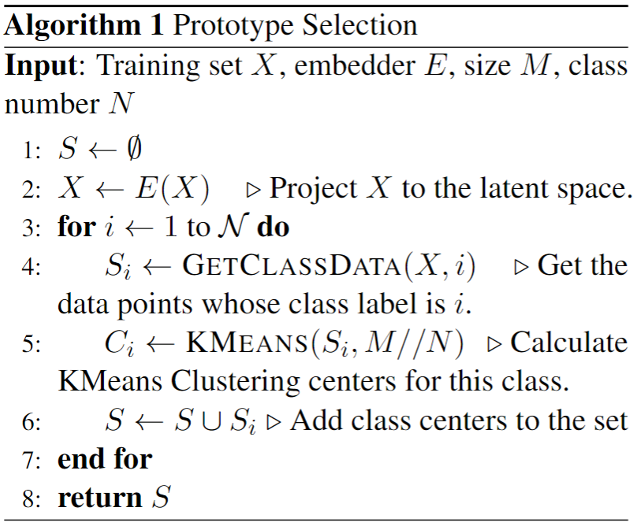
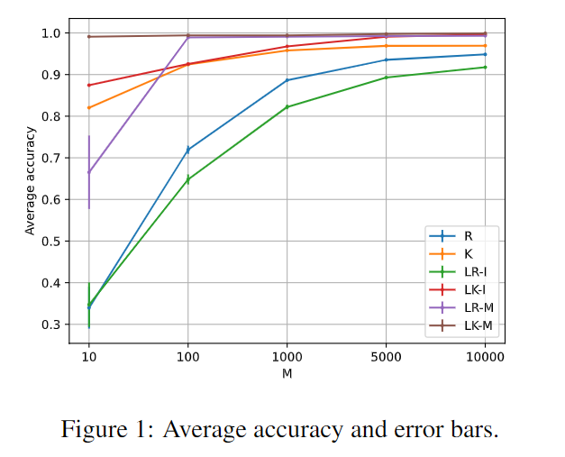
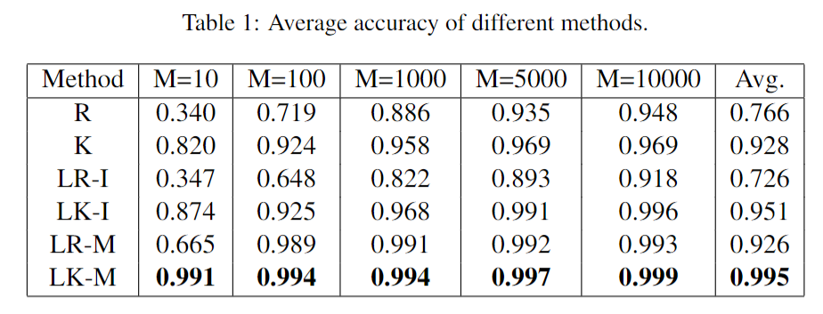
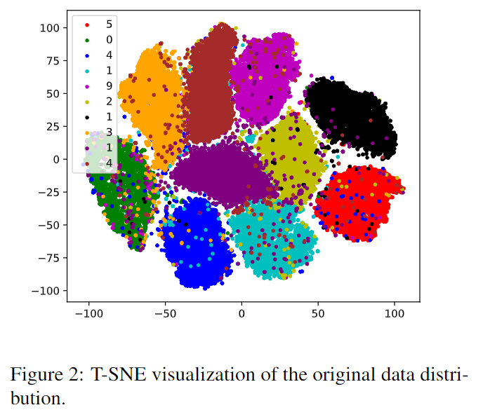
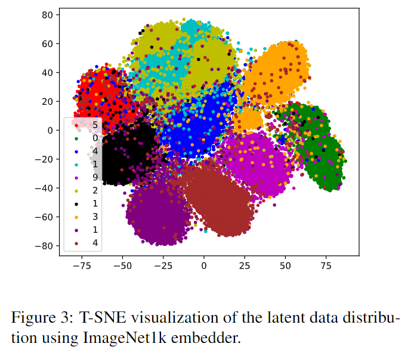
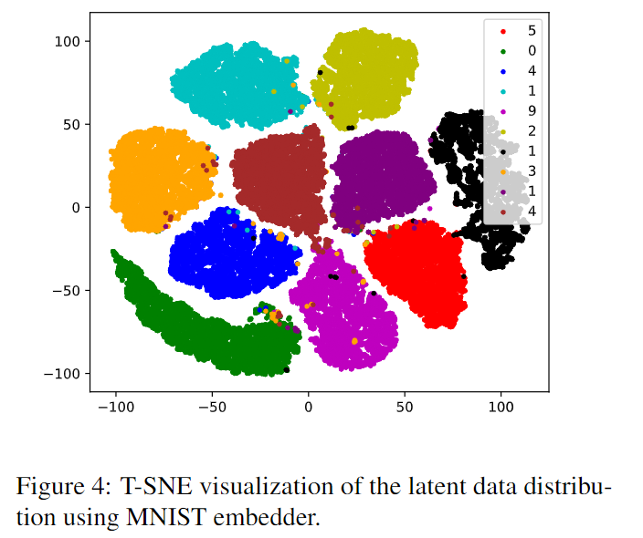

# Latent KMeans Prototype Selection for Nearest Neighbor Classifier

Choosing a representative subset of "prototypes" from the training set is crucial for accelerating nearest neighbor classifiers. This project proposes projecting the data into a latent space using a pretrained embedder, applying in-class KMeans Clustering to the latent representations and taking the clustering centers as the selected prototypes. Experiments demonstrate that the performance of the nearest neighbor classifier with latent KMeans clustering prototypes significantly outperforms other baselines, even with a training set containing as few as 10 points. An ablation study on the embedder's pretraining domain reveals taht using in-domain data for training greatly affects the quality of the representations.

## Description
The performance of nearest neighbor classifier is heavily dependent on the distribution of the training data. Original data, such as image data, often contains a large amount of high-frequency noise, which can impair the effectiveness of the classifier. The perceptual distance in the latent space has been shown to offer advantages over per-pixel distance in the original data space~\citep{johnson2016perceptual}, so it is beneficial to project the data into a meaningful latent space using a pretrained embedder. However, regardless of the space in which the data resides, there can be multiple outliers in each class that would directly affect the nearest neighbor classifier's accuracy. Therefore, this project proposes using the centers derived from latent KMeans clustering as the training data for the nearest neighbor classifier. First, the entire dataset is projected into the latent space using an embedder built from a pretrained classifier. Then, for each class, KMeans Clustering is applied to represent the data points with $M/N$ clustering centers ($M$ is the size of the sub-training set. $N$ is the class number of the classification task). The clustering centers of all classes compose the final training set of the nearest neighbor classifier.

## Pseudocode
Prototype Selection Algorithm calculates the KMeans Clustering centers on each class' embedding data. The original training set is $X$ with $N$ classes. $E$ is the pretrained embedder. $S_i$ is the sub-training set whose label is $i$. The new training set size is $M$. $C_i$ is the clustering centers of $S_i$.

## Performance

It can be observed in Figure1 that the latent KMeans clustering using MNIST embedder method (LK-M) beats or matches all other methods with nearly 100\% accuracy across all experimented $M$ values. Latent Random Selection with MNIST (LR-M) also outperforms random selection and KMeans baseline when $M>10$. Both of them demonstrate the superiority of the proposed method. In general, larger $M$ yields better classification performance. All the methods have a relatively decent performance when $M>=1000$, but when $M=10$ or $100$, their performance drops significantly, except for LK-M remaining at 99\% accuracy. The highly variable data distribution makes it difficult for random selection method to coincidentally pick the good representatives. However, the centering effect of KMeans methods can mitigate this problem, which explains they outperforms random selection methods when $M$ is small. Figure~\ref{fig:image1}~\ref{fig:image2}~\ref{fig:image3} are the t-SNE~\cite{van2008visualizing} visualizations of the original data, latent data using ImageNet1k embedder and latent data using MNIST embedder. We can see that after the projection using the MNIST embedder, the number of outliers significantly reduces and the boundaries between different classes are more clearer than the other two. This explains the advantage of using a meaningful latent space, which leads to a better classifier at last. Besides the classification performance, since the embedded data's dimension is reduced to 512, so the proposed method also needs 24\% less computation than the baseline, leading to a faster classifier.

# Thank you for supporting
If you think the code useful or like the repo, please kindly star this repo. If you use the code in the repo, please cite this repo. 

